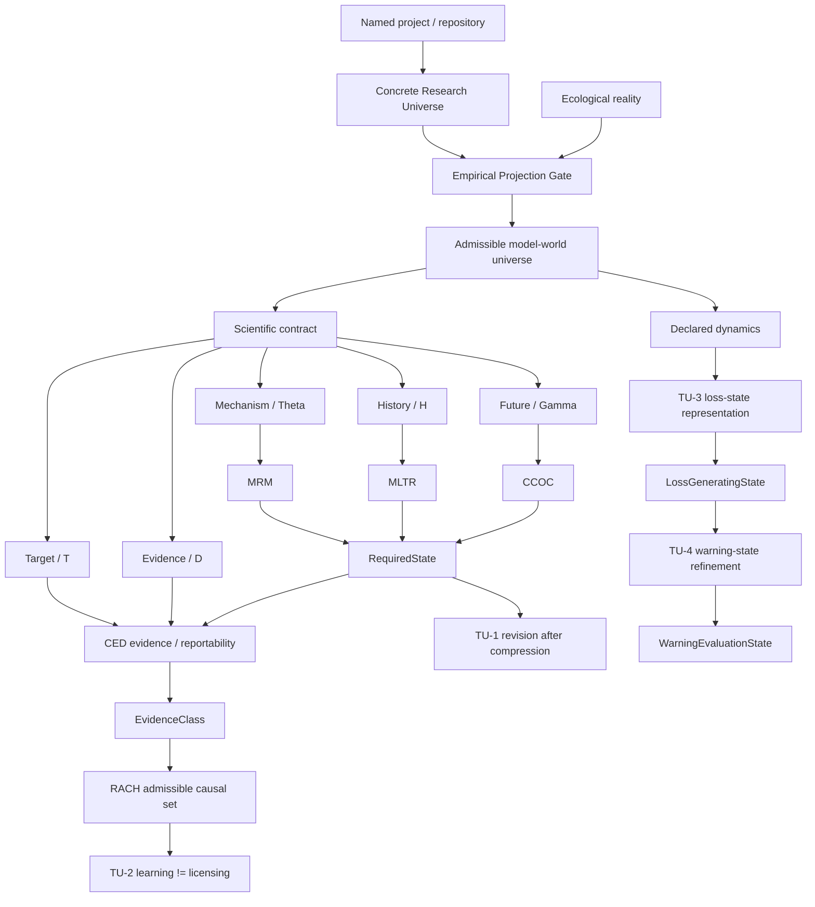

# Theoretical Universe / 理論宇宙

`theouni` is organized as four deliberately separate layers.

1. **Theory Universe v0.5 — frozen semantic core**  
   Worlds, scientific contracts, required states, evidence, learning, revision, loss states, and warning states.
2. **Empirical Projection Gate v0.1 — Reality -> Theory admission**  
   The claim-discipline protocol that decides when measured coordinates may earn target-relative partial-state status.
3. **Concrete Research Universe v0.1 — typed real-research programmes**  
   Five programme archetypes describing what a concrete ecological project contributes to the theory without turning the project itself into a state.
4. **Portfolio Registry — provenance and repository graph**  
   The wider repository ecosystem, typed bridges, source ownership, Graphify view, and provenance.

The direction is intentional:

```text
Theory first
    -> admission rules
    -> concrete research programmes
    -> named repositories / evidence
```

Concrete species, island syndromes, floral polymorphisms, SDMs, sensors, and field workflows do not define the abstract core. They enter only through explicit typed contracts.

## Central programme

> **What may science safely forget, what must remain revisable, and which distinctions are required by the scientific question actually being asked?**

The v0.5 worldview is:

- ecological reality is temporally extended and is not itself a `State`;
- mathematics acts on declared `ModelWorld`s rather than directly on reality;
- a `RequiredState` is a contract-relative quotient of model worlds;
- ecological laws are effective laws on adequate quotients;
- evidence identifies or licenses but does not create structural distinctions;
- causal uncertainty remains set-valued until discriminating evidence exists;
- scientific compression can become unrevisable after a contract changes;
- causal-learning value and target-licensing value are different scientific utilities;
- raw simulator-state complexity is not target-relevant state complexity;
- a `LossGeneratingState` need not be sufficient for warning evaluation;
- within-state warning reproducibility and cross-state warning portability are separate claims.

## One worldline, four layers



## 1. Theory Universe v0.5

Start with:

- [`theory/CONSTITUTION.md`](theory/CONSTITUTION.md) — normative axioms, definitions, claim ceilings, and frozen scientific sentence.
- [`theory/README.md`](theory/README.md) — readable theory-world exposition.
- [`theory/core_universe.json`](theory/core_universe.json) — machine-readable type/operator/theorem registry.
- [`theory/theorem_graph.json`](theory/theorem_graph.json) — prerequisite-to-dependent theorem DAG.
- [`theory/FREEZE_v0.5.json`](theory/FREEZE_v0.5.json) — semantic-core freeze manifest.
- [`theory/CONSISTENCY_AUDIT.md`](theory/CONSISTENCY_AUDIT.md) — cross-repository ownership and anti-collapse audit.

Current `theouni` theorem/firewall modules:

- [`theory/TU1_CONTRACT_REVISION.md`](theory/TU1_CONTRACT_REVISION.md) — revision after scientific compression.
- [`theory/TU2_LEARNING_LICENSING.md`](theory/TU2_LEARNING_LICENSING.md) — causal learning versus target licensing.
- [`theory/TU3_LOSS_STATE_INVARIANCE.md`](theory/TU3_LOSS_STATE_INVARIANCE.md) — loss-state representation invariance.
- [`theory/TU4_WARNING_STATE_PORTABILITY.md`](theory/TU4_WARNING_STATE_PORTABILITY.md) — warning-evaluation state and portability.

The semantic core is frozen at v0.5. Changes to its axioms, canonical type identities, theorem semantics, claim ceilings, or dependency directions require a version increment.

## 2. Empirical Projection Gate v0.1

[`theory/EMPIRICAL_PROJECTION_GATE.md`](theory/EMPIRICAL_PROJECTION_GATE.md) defines the only admissible route from real measurements toward empirical state language.

The empirical contract is

\[
\mathcal P_{emp}=(U,\tau,Z,H,A,Y,\mathcal O,\mathcal V,\Delta,\epsilon).
\]

The key distinction is:

```text
biologically plausible coordinates
    != predictive coordinates
    != empirically supported partial state
```

A candidate coordinate set `Z` must first carry held-out information for the declared future target. Only then is residual upstream context/history `H` tested. Passing the gate supports a bounded, target-relative `EmpiricalPartialState` claim; it never proves a complete natural ontology.

Machine-readable schema/template and validator:

- [`theory/empirical_projection.schema.json`](theory/empirical_projection.schema.json)
- [`theory/empirical_projection.template.json`](theory/empirical_projection.template.json)
- [`theory/validate_empirical_projection.py`](theory/validate_empirical_projection.py)

## 3. Concrete Research Universe v0.1

[`empirical/README.md`](empirical/README.md) classifies concrete research by **what it contributes to the scientific contract**, not by taxon or software.

Five primary archetypes are currently allowed:

| ID | Programme type | Main scientific role |
|---|---|---|
| **CR-1** | Comparative phenomenon | phenomenon/context `H` versus measured process state `Z` |
| **CR-2** | Lineage and trait evolution | history `H`, mechanisms `Theta`, transitions and evolutionary targets |
| **CR-3** | Phenotype / polymorphism / trait construction | construct and test candidate measured coordinates `Z` |
| **CR-4** | Spatial world construction / forecast | construct `Omega`, support, reachability and candidate observation locations |
| **CR-5** | Sensing / observability | construct `ObservationRecord`, effort, calibration and failure architecture |

The main firewall is:

```text
ProgrammeType != RequiredState
MethodType != BiologicalState
ContextLabel != StateByDefault
Predictor != EmpiricalPartialState
WorldSupport != OccupancyOrTruth
ObservationRecord != BiologicalEventWithoutReliabilityBridge
```

Machine-readable definitions and reusable project manifest:

- [`empirical/system_types.json`](empirical/system_types.json)
- [`empirical/project_manifest.template.json`](empirical/project_manifest.template.json)
- [`empirical/validate_empirical_universe.py`](empirical/validate_empirical_universe.py)

A named project must declare exactly one primary CR type, may declare secondary supporting types, and cannot use cross-repository state language until the Empirical Projection Gate earns it.

## 4. Portfolio Registry

The wider research ecosystem remains a separate provenance layer:

- [`universe/ARCHITECTURE.md`](universe/ARCHITECTURE.md) — research-repository architecture.
- [`universe/registry.json`](universe/registry.json) — machine-readable repository/claim registry.
- [`graphify-out/graph.html`](graphify-out/graph.html) — interactive Graphify map.
- [`universe/bridges/eco_genetic_crest_bridge_registry.json`](universe/bridges/eco_genetic_crest_bridge_registry.json) — bounded EcoGenetic -> CREST bridge.
- [`universe/PROVENANCE.json`](universe/PROVENANCE.json) — wider registry provenance manifest.

`theouni` does not acquire ownership of source theorems or empirical evidence merely by connecting their typed outputs.

## Canonical distinctions

```text
Reality
!= ModelWorld
!= Snapshot
!= RequiredState
!= EvidenceClass
!= AdmissibleCausalSet
!= Report
```

and

```text
CompleteSimulatorState != LossGeneratingState
LossGeneratingState <= WarningEvaluationState
StoredStateRepresentation != RevisedRequiredState
CausalLearningValue != TargetLicensingStatus
WarningValidity != WarningPortability
ProgrammeType != RequiredState
```

unless an explicit theorem or bridge establishes the required factorization/equality.

The foundational epistemic distinction remains:

```text
required state != identified state != reportable target
```

TU-1 adds:

```text
state adequate for contract C0
    does not imply
state revisable for later contract C1
```

TU-2 adds:

```text
more causal learning
    does not imply
more target licensing
```

TU-3 adds:

```text
more simulator detail
    does not imply
more target-relevant state
```

TU-4 adds:

```text
same loss state
    does not imply
same warning-evaluation state
```

The empirical layers add:

```text
real-system label or method output
    does not imply
empirical state
```

## Current frontier

The frozen core should not be expanded simply by numbering another TU module. Development now belongs mainly outside the core:

1. **Named-project typing** — assign real repositories to CR-1–CR-5 without granting state claims.
2. **Projection manifests** — instantiate `(U,tau,Z,H,A,Y,O,V,Delta,epsilon)` for each concrete programme.
3. **Empirical-state factorization** — evaluate candidate `Z` first, residual context/history second, using whole ecological units held out.
4. **Observation licensing** — connect sensing/calibration to CED before sensor records become biological evidence.
5. **Spatial-world semantics** — preserve the distinction among suitability, support, reachability, occupancy and observation candidates.
6. **Cross-system portability** — require target and observation semantics to commute before comparing empirical partial states across systems.

## Validation

```text
python theory/validate_core.py
python theory/validate_theory_graph.py
python theory/verify_tu1.py
python theory/verify_tu2.py
python theory/verify_tu3.py
python theory/verify_tu4.py
python theory/validate_freeze.py
python theory/validate_empirical_projection.py
python empirical/validate_empirical_universe.py
```

GitHub Actions runs these checks whenever `theory/**`, `empirical/**`, the root README, or the validation workflow changes. The wider portfolio/Graphify validation remains a separate provenance task.
