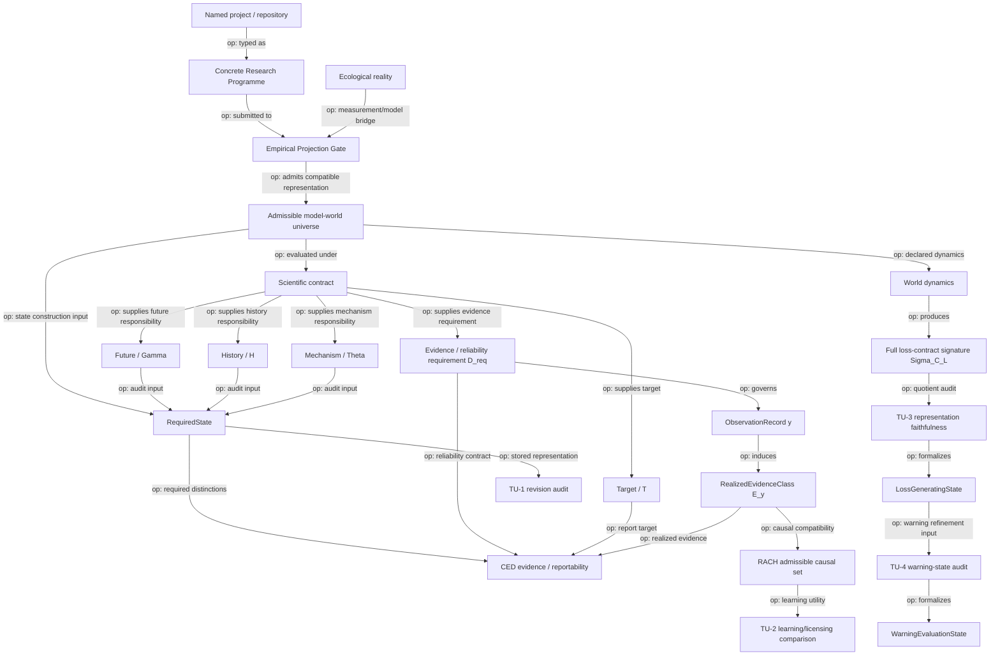

# Theoretical Universe / 理論宇宙

`theouni` is organized as four deliberately separate layers.

1. **Theory Universe v0.5.1 — current interpretation over frozen v0.5 core**  
   Worlds, scientific contracts, required states, evidence, learning, revision, loss states, and warning states. v0.5.1 clarifies `D_req != E_y` and requires a contract-complete loss-response signature.
2. **Empirical Projection Gate v0.1 — Reality -> Theory admission**  
   The claim-discipline protocol that decides when measured coordinates may earn target-relative partial-state status.
3. **Concrete Research Universe v0.1 — typed real-research programmes**  
   Five programme archetypes describing what a concrete ecological project contributes to the theory without turning the project itself into a state.
4. **Portfolio Registry — provenance and repository graph**  
   The wider repository ecosystem, typed bridges, source ownership, Graphify view, and provenance.

## Two directions, two relation types

The repository distinguishes **normative design order** from **operational admission flow**.

Normative design order:

\[
\boxed{
\text{Theory}
\prec_{\rm norm}
\text{Admission rules}
\prec_{\rm norm}
\text{Programme schemas}
\prec_{\rm norm}
\text{Named-project manifests}
}
\]

Operational admission flow:

\[
\boxed{
\text{Named project}
\to_{\rm op}
\text{Programme typing}
\to_{\rm op}
\text{Admission gate}
\to_{\rm op}
\text{Model-world / evidence objects}
}
\]

These are not contradictory arrow directions because they are not the same relation. See [`theory/RELATION_SEMANTICS.md`](theory/RELATION_SEMANTICS.md).

Concrete species, island syndromes, floral polymorphisms, SDMs, sensors, and field workflows do not define the abstract core. They enter only through explicit typed contracts.

## Central programme

> **What may science safely forget, what must remain revisable, and which distinctions are required by the scientific question actually being asked?**

The current worldview is:

- ecological reality is temporally extended and is not itself a `State`;
- mathematics acts on declared `ModelWorld`s rather than directly on reality;
- a `RequiredState` is a contract-relative quotient of model worlds;
- ecological laws are effective laws on adequate quotients;
- `D_req` is a pre-observation evidence/reliability requirement, whereas `E_y^{D_req}` is the realized post-observation compatible-world class;
- evidence identifies or licenses but does not create structural distinctions;
- causal uncertainty remains set-valued until discriminating evidence exists;
- scientific compression can become unrevisable after a contract changes;
- causal-learning value and target-licensing value are different scientific utilities;
- raw simulator-state complexity is not target-relevant state complexity;
- `LossGeneratingState` is defined by the full response signature required by the loss contract, not automatically by one scalar loss summary;
- a `LossGeneratingState` need not be sufficient for warning evaluation;
- within-state warning reproducibility and cross-state warning portability are separate claims.

## Operational scientific flow

The following Mermaid diagram uses **solid arrows only for operational/data/inference flow**. Normative dependency is documented separately in `RELATION_SEMANTICS.md` and the theorem DAG.



## 1. Theory Universe v0.5.1

The immutable base remains v0.5; the current interpretation layer is v0.5.1.

Start with:

- [`theory/CURRENT.json`](theory/CURRENT.json) — current version pointer and immutable base.
- [`theory/CONSTITUTION.md`](theory/CONSTITUTION.md) — frozen v0.5 axioms, definitions, claim ceilings, and scientific sentence.
- [`theory/CLARIFICATION_v0.5.1.md`](theory/CLARIFICATION_v0.5.1.md) — current semantic clarification of evidence and loss-response notation.
- [`theory/clarification_v0.5.1.json`](theory/clarification_v0.5.1.json) — machine-readable clarification contract.
- [`theory/README.md`](theory/README.md) — readable current theory exposition.
- [`theory/core_universe.json`](theory/core_universe.json) — frozen v0.5 type/operator/theorem registry.
- [`theory/theorem_graph.json`](theory/theorem_graph.json) — frozen prerequisite-to-dependent theorem DAG.
- [`theory/FREEZE_v0.5.json`](theory/FREEZE_v0.5.json) — semantic-core identity freeze.
- [`theory/REVISION_RESERVE.md`](theory/REVISION_RESERVE.md) — bounded self-application safeguard distinguishing freeze identity from revisability.
- [`theory/revision_reserve.json`](theory/revision_reserve.json) — machine-readable reserve pointers and explicit non-guarantees.
- [`theory/RELATION_SEMANTICS.md`](theory/RELATION_SEMANTICS.md) — typed normative, operational, and provenance arrows.
- [`theory/CONSISTENCY_AUDIT.md`](theory/CONSISTENCY_AUDIT.md) — cross-repository ownership and anti-collapse audit.

Current `theouni` theorem/firewall modules:

- [`theory/TU1_CONTRACT_REVISION.md`](theory/TU1_CONTRACT_REVISION.md) — revision after scientific compression.
- [`theory/TU2_LEARNING_LICENSING.md`](theory/TU2_LEARNING_LICENSING.md) — causal learning versus target licensing.
- [`theory/TU3_LOSS_STATE_INVARIANCE.md`](theory/TU3_LOSS_STATE_INVARIANCE.md) — loss-state representation invariance.
- [`theory/TU4_WARNING_STATE_PORTABILITY.md`](theory/TU4_WARNING_STATE_PORTABILITY.md) — warning-evaluation state and portability.

The v0.5.1 patch does **not** alter the theorem dependency graph or expand claim ceilings. It fixes two dangerous readings:

```text
D_req == realized evidence
```

and

```text
one convenient loss statistic == full LossGeneratingState
```

Both are now forbidden.

### Draft v0.6 synthesis

[`theory/DRAFT_v0.6_CONTRACT_INDEXED_QUOTIENT_TRANSPORT.md`](theory/DRAFT_v0.6_CONTRACT_INDEXED_QUOTIENT_TRANSPORT.md) tests whether the four TU modules can be conceptually collapsed into one more general principle.

Its current conclusion is deliberately asymmetric:

```text
TU-1, TU-3, TU-4
    = exact specializations of task-indexed factorization / reuse

TU-2
    = graded epistemic analogue, not literally the same exact theorem
```

The precise principle is **failure of order transport across incomparable scientific tasks**, not generic noncommutativity of quotient formation.

The draft is not part of the frozen core and carries no standalone mathematical novelty claim.

## 2. Empirical Projection Gate v0.1

[`theory/EMPIRICAL_PROJECTION_GATE.md`](theory/EMPIRICAL_PROJECTION_GATE.md) defines the only admissible route from real measurements toward empirical state language.

The empirical contract is

\[
\mathcal P_{emp}=(U,\tau,Z,H,A,Y,\mathcal O,\mathcal V,\Delta,\epsilon).
\]

The key distinction is:

```text
biologically plausible coordinates
    != predictive coordinates
    != empirically supported partial state
```

The gate does **not** claim causal identification. Its main addition over ordinary cross-validation is that ecological unit, time/cohort, candidate state, upstream context, target/action family, reliability model, validation unit, decision thresholds, failure classes, and claim ceiling are preregistered as **one typed contract**.

A candidate coordinate set `Z` must first carry held-out information for the declared future target. Only then is the predeclared upstream context/history set `H` tested for residual predictive gain. Passing the gate supports a bounded, target-relative **predictive** `EmpiricalPartialState` claim; it never proves a complete or causally sufficient natural state.

Machine-readable schema/template and validator:

- [`theory/empirical_projection.schema.json`](theory/empirical_projection.schema.json)
- [`theory/empirical_projection.template.json`](theory/empirical_projection.template.json)
- [`theory/validate_empirical_projection.py`](theory/validate_empirical_projection.py)

## 3. Concrete Research Universe v0.1

[`empirical/README.md`](empirical/README.md) classifies concrete research by **what it contributes to the scientific contract**, not by taxon or software.

Five primary archetypes are currently allowed:

| ID | Programme type | Main scientific role |
|---|---|---|
| **CR-1** | Comparative phenomenon | phenomenon/context `H` versus measured process state `Z` |
| **CR-2** | Lineage and trait evolution | history `H`, mechanisms `Theta`, transitions and evolutionary targets |
| **CR-3** | Phenotype / polymorphism / trait construction | construct and test candidate measured coordinates `Z` |
| **CR-4** | Spatial world construction / forecast | construct `Omega`, support, reachability and candidate observation locations |
| **CR-5** | Sensing / observability | construct `ObservationRecord`, effort, calibration and failure architecture |

The main firewall is:

```text
ProgrammeType != RequiredState
MethodType != BiologicalState
ContextLabel != StateByDefault
Predictor != EmpiricalPartialState
WorldSupport != OccupancyOrTruth
ObservationRecord != BiologicalEventWithoutReliabilityBridge
```

Machine-readable definitions and reusable project manifest:

- [`empirical/system_types.json`](empirical/system_types.json)
- [`empirical/project_manifest.template.json`](empirical/project_manifest.template.json)
- [`empirical/validate_empirical_universe.py`](empirical/validate_empirical_universe.py)
- [`empirical/reality_theory_graph.json`](empirical/reality_theory_graph.json) — path-level Reality-to-Theory firewalls.

A named project must declare exactly one primary CR type, may declare secondary supporting types, and cannot use cross-repository state language until the Empirical Projection Gate earns it.

## 4. Portfolio Registry

The wider research ecosystem remains a separate provenance layer:

- [`universe/ARCHITECTURE.md`](universe/ARCHITECTURE.md) — research-repository architecture.
- [`universe/registry.json`](universe/registry.json) — machine-readable repository/claim registry.
- [`graphify-out/graph.html`](graphify-out/graph.html) — interactive Graphify map.
- [`universe/bridges/eco_genetic_crest_bridge_registry.json`](universe/bridges/eco_genetic_crest_bridge_registry.json) — bounded EcoGenetic -> CREST bridge.
- [`universe/PROVENANCE.json`](universe/PROVENANCE.json) — wider registry provenance manifest.

`theouni` does not acquire ownership of source theorems or empirical evidence merely by connecting their typed outputs.

## Canonical distinctions

```text
Reality
!= ModelWorld
!= Snapshot
!= RequiredState
!= E_y^{D_req}
!= AdmissibleCausalSet
!= Report
```

and

```text
D_req != E_y^{D_req}
CompleteSimulatorState != LossGeneratingState
single loss summary != LossGeneratingState by default
LossGeneratingState <= WarningEvaluationState
StoredStateRepresentation != RevisedRequiredState
CausalLearningValue != TargetLicensingStatus
WarningValidity != WarningPortability
ProgrammeType != RequiredState
FreezeIntegrity != FutureRevisability
NormativeDependency != OperationalFlow != Provenance
```

unless an explicit theorem or bridge establishes the required factorization/equality.

The foundational epistemic distinction remains:

```text
required state != identified state != reportable target
```

TU-1 adds:

```text
state adequate for contract C0
    does not imply
state revisable for later contract C1
```

TU-2 adds:

```text
more causal learning
    does not imply
more target licensing
```

TU-3 adds:

```text
more simulator detail
    does not imply
more target-relevant state
```

and v0.5.1 sharpens it to:

```text
same one loss summary
    does not imply
same full loss-contract state
```

TU-4 adds:

```text
same LossGeneratingState
    does not imply
same WarningEvaluationState
```

The empirical layers add:

```text
real-system label or method output
    does not imply
empirical state
```

## Current frontier

The frozen core should not be expanded simply by numbering another TU module. Development now belongs mainly at the genuinely open bridges:

1. **v0.6 synthesis audit** — determine whether the contract-indexed quotient-transport theorem is the correct single meta-principle and whether it clarifies rather than trivializes the ecology.
2. **Positive bridge completion** — move beyond anti-collapse firewalls by completing at least one multi-source bridge end-to-end with source semantics, factorization condition, evidence gate, and claim ceiling.
3. **Projection manifests** — instantiate `(U,tau,Z,H,A,Y,O,V,Delta,epsilon)` for concrete programmes.
4. **Empirical-state factorization** — evaluate candidate `Z` first, residual context/history second, using whole ecological units held out.
5. **Observation licensing** — connect sensing/calibration to CED before sensor records become biological evidence.
6. **Cross-system portability** — require target and observation semantics to commute before comparing empirical partial states across systems.
7. **Beyond finite exact** — extend state/factorization results to stochastic, approximate and delayed-observation settings without collapsing the clarified type boundaries.

## Validation

```text
python theory/validate_core.py
python theory/validate_theory_graph.py
python theory/verify_tu1.py
python theory/verify_tu2.py
python theory/verify_tu3.py
python theory/verify_tu4.py
python theory/validate_freeze.py
python theory/validate_clarification_v0_5_1.py
python theory/verify_contract_indexed_quotient_transport.py
python theory/validate_empirical_projection.py
python empirical/validate_empirical_universe.py
python empirical/validate_reality_theory_graph.py
```

GitHub Actions runs these checks whenever `theory/**`, `empirical/**`, the root README, or the validation workflow changes. The wider portfolio/Graphify validation remains a separate provenance task.
