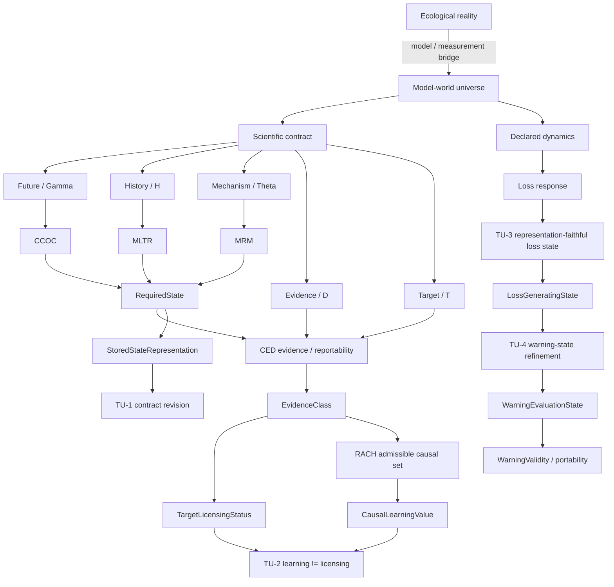

# Theoretical Universe / 理論宇宙

`theouni` has two deliberately separate layers.

1. **Theory Universe v0.5** — the theory-first ontology and mathematics of worlds, states, evidence, learning, revision, target-specific dynamics, and warning.
2. **Portfolio Registry** — the provenance-preserving map of the wider repository ecosystem and its typed bridges.

The theory layer comes first. Species, island syndromes, floral polymorphisms, SDMs, sensors, and field workflows do not define the abstract core; they are projected into it later through explicit empirical contracts.

## Central programme

> **What may science safely forget, what must remain revisable, and which distinctions are required by the scientific question actually being asked?**

The v0.5 worldview is:

- ecological reality is temporally extended and is not itself a `State`;
- mathematics acts on declared `ModelWorld`s rather than directly on reality;
- a `RequiredState` is a contract-relative quotient of model worlds;
- ecological laws are effective laws on adequate quotients;
- evidence identifies or licenses but does not create structural distinctions;
- causal uncertainty remains set-valued until discriminating evidence exists;
- scientific compression can become unrevisable after a contract changes;
- causal-learning value and target-licensing value are different scientific utilities;
- raw simulator-state complexity is not target-relevant state complexity;
- a `LossGeneratingState` need not be sufficient for warning evaluation;
- within-state warning reproducibility and cross-state warning portability are separate claims.



## Start here

### Theory Universe

- [`theory/CONSTITUTION.md`](theory/CONSTITUTION.md) — normative v0.5 axioms, definitions, claim ceilings, and frozen scientific sentence.
- [`theory/README.md`](theory/README.md) — readable theory-world exposition.
- [`theory/core_universe.json`](theory/core_universe.json) — machine-readable type/operator/theorem registry.
- [`theory/theorem_graph.json`](theory/theorem_graph.json) — frozen prerequisite-to-dependent theorem DAG.
- [`theory/CONSISTENCY_AUDIT.md`](theory/CONSISTENCY_AUDIT.md) — cross-repository ownership and anti-collapse audit.

The four current `theouni` theorem/firewall modules are:

- [`theory/TU1_CONTRACT_REVISION.md`](theory/TU1_CONTRACT_REVISION.md) — TU-1: contract revision after compression.
- [`theory/TU2_LEARNING_LICENSING.md`](theory/TU2_LEARNING_LICENSING.md) — TU-2: causal learning versus target licensing.
- [`theory/TU3_LOSS_STATE_INVARIANCE.md`](theory/TU3_LOSS_STATE_INVARIANCE.md) — TU-3: loss-state representation invariance.
- [`theory/TU4_WARNING_STATE_PORTABILITY.md`](theory/TU4_WARNING_STATE_PORTABILITY.md) — TU-4: warning evaluation state and portability.

Each module has a machine-readable registry, finite implementation, and verification script in `theory/`.

### Portfolio Registry

- [`universe/ARCHITECTURE.md`](universe/ARCHITECTURE.md) — wider research-repository architecture.
- [`universe/registry.json`](universe/registry.json) — machine-readable repository/claim registry.
- [`graphify-out/graph.html`](graphify-out/graph.html) — interactive Graphify map.
- [`universe/bridges/eco_genetic_crest_bridge_registry.json`](universe/bridges/eco_genetic_crest_bridge_registry.json) — bounded EcoGenetic -> CREST bridge.
- [`universe/PROVENANCE.json`](universe/PROVENANCE.json) — wider registry provenance manifest.

## Core theoretical ownership

| Layer | Primary owner |
|---|---|
| world / contract / least adequate state | `crest` |
| future obstruction | `ccoc` |
| historical-semantic transport / repair | `mltr` |
| mechanism-robust state / law | `mrm` |
| evidence / reportability | `ced` |
| causal admissibility / next observation | `microdonta` / RACH |
| eco-genetic dynamics / simulator-state boundary | `eco-genetic-criticality` |
| warning-blind loss conditioning and empirical warning results | `eco-genetic-warning-extensions` |
| cross-repository type system | `theouni` |
| contract revision after compression | `theouni` / TU-1 |
| learning/licensing bridge firewall | `theouni` / TU-2 |
| loss-state representation firewall | `theouni` / TU-3 |
| warning-state/portability firewall | `theouni` / TU-4 |

`theouni` does not acquire ownership of source theorems or empirical evidence merely by connecting their typed outputs.

## Canonical distinctions

```text
Reality
!= ModelWorld
!= Snapshot
!= RequiredState
!= EvidenceClass
!= AdmissibleCausalSet
!= Report
```

and

```text
CompleteSimulatorState != LossGeneratingState
LossGeneratingState <= WarningEvaluationState
StoredStateRepresentation != RevisedRequiredState
CausalLearningValue != TargetLicensingStatus
WarningValidity != WarningPortability
```

unless an explicit theorem or bridge establishes the required factorization/equality.

The foundational epistemic distinction remains:

```text
required state != identified state != reportable target
```

TU-1 adds:

```text
state adequate for contract C0
    does not imply
state revisable for later contract C1
```

TU-2 adds:

```text
more causal learning
    does not imply
more target licensing
```

TU-3 adds:

```text
more simulator detail
    does not imply
more target-relevant state
```

TU-4 adds:

```text
same loss state
    does not imply
same warning-evaluation state
```

## Theory Universe v0.5 status

The universe is now internally typed through four finite cross-layer modules.

### TU-1 — revision

For old stored partition `P` and revised required partition `Q`, state-only revision succeeds exactly when `Q` factors through `P`. Otherwise TU-1 gives the exact minimum idealized auxiliary alphabet needed to recover the revised state and a worst-case revision-debt measure. Local debt can be arbitrarily large while average refinement debt is arbitrarily small.

### TU-2 — scientific utility

A finite product-world construction gives observations with maximal normalized causal-learning value but zero target licensing, and observations with zero causal-learning value but complete target licensing. RACH-style learning and CED-style reporting objectives can therefore rank equal-cost observations in opposite order.

### TU-3 — representation

A raw representation is loss-faithful exactly when its declared loss-response signature factors through the representation projection. Arbitrarily many nuisance coordinates can inflate simulator state without changing the loss quotient; one hidden target-relevant coordinate is enough to break the projection.

### TU-4 — warning

The warning-evaluation quotient preserves both loss and warning responses and therefore refines the loss-only quotient. Equality holds only when warning response is constant within loss-state classes. Warning portability across domains requires a further explicit cross-state commutation condition.

These modules currently function mainly as **type-safe composition results**. Their elementary finite substrates overlap established mathematics; `theouni` does not yet claim that TU-1–4 are standalone mathematical novelties independent of prior art.

## Boundary to empirical ecology

A concrete empirical object does not become a state coordinate because it is plausible, proximal, or fashionable.

Empirical projects enter only through a typed projection of the form

```text
empirical system
    -> empirical unit / time / cohort
    -> model-world or candidate-world universe
    -> scientific contract
    -> observation / reliability model
    -> target
    -> external or held-out adequacy test
    -> claim ceiling
```

This later layer is where thistles, island syndromes, flower-colour polymorphism, trait construction, SDM-derived sampling methods, visit cameras, and other concrete programmes will be connected.

## Current mathematical frontier

The next development should not simply add TU-5 because a label is available. It should close one of the genuinely open bridges:

1. **Reality -> Model adequacy** — what warrants treating a mathematical world set as an adequate empirical representation?
2. **Beyond finite exact state** — stochastic, continuous, approximate, tolerance-qualified and delayed-observation extensions.
3. **Carrier-changing revision** — extend TU-1 through replacement relations/common lifts and identify invariant revision cost.
4. **Learning/licensing coincidence** — characterize when causal-learning and risk-limited target objectives actually agree.
5. **Empirical-state factorization** — when do measured coordinates make upstream origin/history/mechanism redundant for held-out future targets?
6. **Empirical warning-state identification** — when do measurable natural coordinates identify enough of the warning-evaluation state for defensible portability claims?

The most important next bridge for connecting this worldview to the concrete research universe is **empirical-state factorization**, but it remains outside the frozen v0.5 theorem claims.

## Validation

```text
python theory/validate_core.py
python theory/validate_theory_graph.py
python theory/verify_tu1.py
python theory/verify_tu2.py
python theory/verify_tu3.py
python theory/verify_tu4.py

python scripts/build_curated_graph.py
python scripts/build_graph.py
python scripts/write_provenance_manifest.py
python scripts/validate_universe.py
```

The theory validators check type consistency and finite theorem-module contracts. The wider universe validators check the provenance-preserving repository registry and generated Graphify view.
