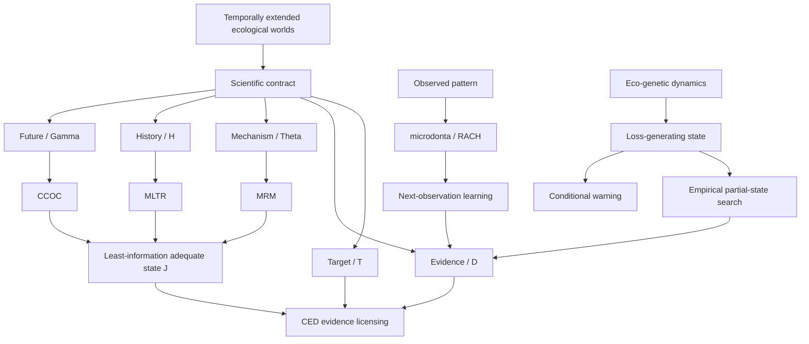

# Theoretical Universe / 理論宇宙

`theouni` は、`zuizui0223` の研究群を一つの理論宇宙として読むための
**meta-registry** です。各リポジトリの理論・コード・データ・証拠をここへ
移管するのではなく、それぞれの所有境界を保ったまま、ontology、contract、
claim、evidence、non-claim と bridge を横断的に索引します。

中心命題は次です。

> 生態学的 state とは自然の瞬間像そのものではない。時間的に厚い生態学的
> world から、未来・履歴・機構・証拠・学習・意思決定に必要な差異だけを残す、
> 科学的に許された圧縮である。



## まず見るもの

- [理論宇宙の俯瞰文書](universe/ARCHITECTURE.md)
- [machine-readable registry](universe/registry.json)
- [interactive Graphify map](graphify-out/graph.html)
- [Graphify audit report](graphify-out/GRAPH_REPORT.md)
- [EcoGeneticState → CREST bounded bridge](universe/bridges/eco_genetic_crest_bridge_registry.json)
- [provenance manifest](universe/PROVENANCE.json)

## 宇宙の層

| 層 | 中心問い | 主な所有リポジトリ |
|---|---|---|
| World / State | 何を同じ state と呼んでよいか | `crest` |
| Future | 将来を開くと現在の圧縮は壊れるか | `ccoc` |
| History | 置換後も意味や法則を運べるか | `mltr` |
| Mechanism | 候補機構を残して同じ law を言えるか | `mrm` |
| Evidence | 必要な区別を証拠が識別・報告できるか | `ced` |
| Learning | 原因候補をどう残し、次に何を測るか | `microdonta` / RACH |
| Dynamics | state と機能・遺伝・分断がどう変化するか | `eco-genetic-criticality` |
| Warning | どの loss-generating state 内で warning が再現するか | `eco-genetic-warning-extensions` |
| Forecast / Observation | world set、候補地、観測過程をどう接続するか | `eog`, `sdmr`, `acsp`, `pollipi`, `insepi` |
| Empirical systems | 理論 contract をどこで測定・反証するか | `island`, `izu-core`, `azami`, `EAzami`, `chun` ほか |

## 最重要の区別

```text
required state  !=  identified state  !=  reportable target
```

- `CompleteSimulatorState` は、宣言された simulator closure で十分でも、
  最小または自然な state とは限りません。
- `EmpiricalPartialState` は、有望な測定変数の集合だけでは state になりません。
  held-out future endpoint に対する情報を獲得して初めて候補になります。
- `ObservabilityState`、`EOG LatentWorldState`、`CREST RequiredState` は別の型です。
- Graphify の edge は探索経路であり、科学的主張の独立した証明ではありません。

## 現在の bridge 状態

最初の実装済み bridge は `EcoGeneticState → CREST Contract` です。aligned と
anti-aligned の二世界 carrier では、粗い marginal summary が一致しても exact
next-interaction response が異なるため、CREST quotient は二つの required-state
block に分かれます。これは bounded counterexample であり、全 simulator または
warning domain の最小 quotient を確定するものではありません。

その他の RACH→MRM→CED、PolliPi/InsePi→CED、SDMR→EOG→ACSP、
EAzami/chun→MLTR bridge は、registry に未実装または schema-missing として残します。

## 所有と更新の原則

1. 各科学的 claim と evidence の正本は元リポジトリに残す。
2. `theouni` は snapshot SHA、source path、claim ceiling、explicit non-claim を記録する。
3. 未実装 bridge を実装済みに見せない。
4. frozen / no-peek validation を再調整、再ラベル、開発データ化しない。
5. graph centrality を theorem、empirical identification、publication evidence の代用にしない。

俯瞰図の再生成と検証は次で行えます。

```text
python scripts/build_curated_graph.py
python scripts/build_graph.py
python scripts/write_provenance_manifest.py
python scripts/validate_universe.py
```
