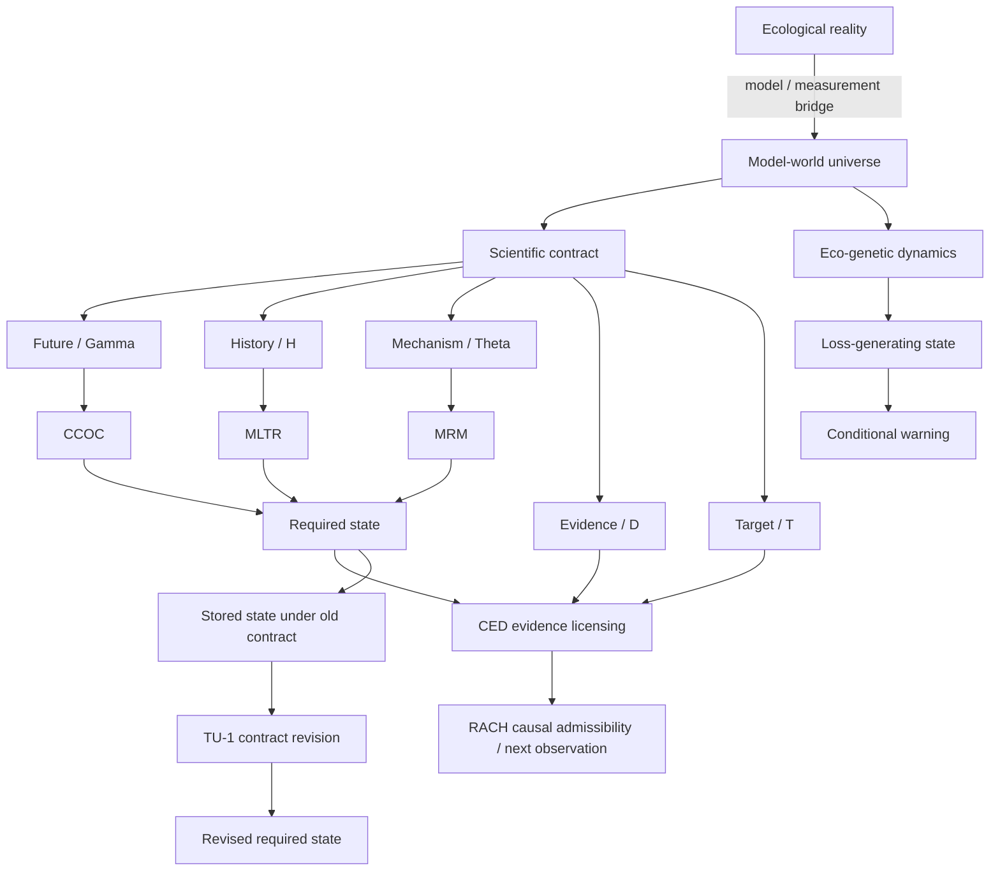

# Theoretical Universe / 理論宇宙

`theouni` has two deliberately separate layers.

1. **Theory Universe** — the theory-first ontology and mathematics of worlds, states, evidence, learning, revision, dynamics, and warning.
2. **Portfolio Registry** — the provenance-preserving map of the wider repository ecosystem and its typed bridges.

The theory layer comes first. Concrete species, island syndromes, SDMs, sensors, and empirical workflows do not define the core theory; they are projected into it later through explicit contracts.

## Central programme

> **What may science safely forget, and what must be retained so that later scientific responsibilities remain revisable?**

The current worldview is:

- ecological reality is temporally extended and is not itself a `State`;
- mathematics acts on declared `ModelWorld`s rather than directly on reality;
- a `RequiredState` is a contract-relative quotient of model worlds;
- ecological laws are effective laws on adequate quotients;
- `EvidenceClass` is epistemic and is not the same object as `RequiredState`;
- causal uncertainty remains set-valued until discriminating evidence exists;
- warning validity is conditional on a declared loss-generating state;
- a state that was adequate for one contract can become unrevisable after later responsibilities require distinctions that were previously forgotten.



## Start here

### 1. Theory Universe

- [`theory/README.md`](theory/README.md) — canonical theory-world statement.
- [`theory/core_universe.json`](theory/core_universe.json) — machine-readable type system.
- [`theory/CONSISTENCY_AUDIT.md`](theory/CONSISTENCY_AUDIT.md) — ownership and anti-collapse audit.
- [`theory/TU1_CONTRACT_REVISION.md`](theory/TU1_CONTRACT_REVISION.md) — first `theouni` theorem module: revision after compression.
- [`theory/tu1_registry.json`](theory/tu1_registry.json) — TU-1 claim/evidence ceiling.
- [`theory/contract_revision.py`](theory/contract_revision.py) and [`theory/verify_tu1.py`](theory/verify_tu1.py) — executable finite construction.

### 2. Portfolio Registry

- [`universe/ARCHITECTURE.md`](universe/ARCHITECTURE.md) — 24-repository architecture.
- [`universe/registry.json`](universe/registry.json) — machine-readable repository/claim registry.
- [`graphify-out/graph.html`](graphify-out/graph.html) — interactive Graphify map.
- [`universe/bridges/eco_genetic_crest_bridge_registry.json`](universe/bridges/eco_genetic_crest_bridge_registry.json) — bounded EcoGenetic -> CREST bridge.
- [`universe/PROVENANCE.json`](universe/PROVENANCE.json) — provenance manifest.

## Core theoretical ownership

| Layer | Primary owner |
|---|---|
| World / contract / least adequate state | `crest` |
| Future obstruction | `ccoc` |
| Historical-semantic transport / repair | `mltr` |
| Mechanism-robust state / law | `mrm` |
| Evidence / reportability | `ced` |
| Causal admissibility / next observation | `microdonta` / RACH |
| Eco-genetic dynamics / simulator-state boundary | `eco-genetic-criticality` |
| Loss-state recovery / conditional warning | `eco-genetic-warning-extensions` |
| Cross-repository type system | `theouni` |
| Contract revision after compression | `theouni` / TU-1 |

## Canonical distinctions

```text
Reality
!= ModelWorld
!= Snapshot
!= RequiredState
!= EvidenceClass
!= AdmissibleCausalSet
!= Report
```

and

```text
CompleteSimulatorState != Minimal/Natural RequiredState
WarningStatistic != LossGeneratingState
StoredStateRepresentation != RevisedRequiredState
```

unless an explicit theorem or typed bridge establishes the needed factorization.

The long-standing central distinction remains:

```text
required state != identified state != reportable target
```

TU-1 adds a temporal distinction:

```text
state adequate for contract C0
    does not imply
state revisable for later contract C1
```

## TU-1 status

TU-1 deliberately does **not** re-claim CREST-J1's common-lift closure result. CREST already proves that noncommuting refinement audits converge under fair iteration to one least joint state on a declared finite common carrier.

TU-1 instead asks what happens after an old state has already been stored.

For old partition `P` and revised required partition `Q`:

- state-only revision succeeds iff every `P` block lies inside one `Q` block;
- otherwise the exact minimum auxiliary alphabet is the maximum number of `Q` blocks hidden inside any single `P` block;
- worst-case local revision debt can be arbitrarily large while global average partition-refinement debt is arbitrarily small.

The finite coding/factorization substrate is elementary and overlaps classical zero-error side-information ideas. No standalone information-theory novelty claim is made without further prior-art audit.

## Boundary to empirical ecology

Species, islands, floral polymorphisms, SDM methods, visit cameras, and other concrete research programmes enter only through typed projections such as

```text
empirical system
    -> model-world universe
    -> scientific contract
    -> observation/reliability map
    -> target
```

with explicit claim ceilings. Their role is to instantiate, test, falsify, or expose missing coordinates in the theory universe.

## Validation

```text
python theory/validate_core.py
python theory/verify_tu1.py

python scripts/build_curated_graph.py
python scripts/build_graph.py
python scripts/write_provenance_manifest.py
python scripts/validate_universe.py
```

The theory validators check the theory-first type firewall. The universe validators check the broader provenance-preserving repository registry and generated graph.
