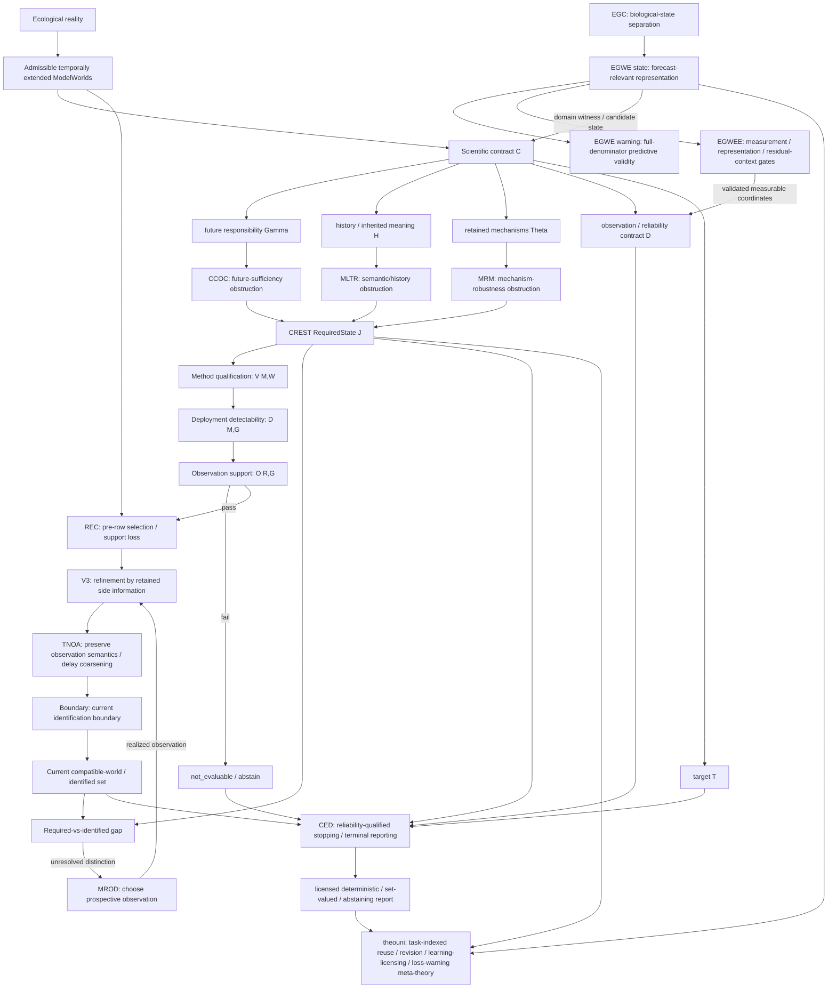

# World–State–Evidence hierarchy — 2026-09-09 synchronized synthesis

> **Status:** current cross-repository synthesis layer. This document does not modify the frozen Theory Universe v0.5 core, transfer theorem ownership, or turn empirical results into general theorems. The 2026-09-09 synchronization adds an explicit inferential-qualification and realized observation-support bridge between required state and retained evidence.

## 1. One shared worldview

The source programmes are not competing definitions of ecological state. They address different stages of one scientific problem:

> **A temporally extended ecological world contains more distinctions than any one scientific task needs. A scientific contract determines which distinctions matter; an inferential design must be qualified for those distinctions on a declared world family and deployment geometry; the realized measurement process determines whether enough support survives to instantiate that qualified design; the retained observation system determines which distinctions are actually identified; and terminal evidence rules determine what may be reported.**

The common type separation is

```text
EcologicalReality
!= ModelWorld
!= RequiredState
!= MethodValidity
!= DeploymentDetectability
!= ObservationSupport
!= ObservationRecord
!= CompatibleWorldSet
!= ReportableTarget
!= EmpiricalPartialState
```

unless an explicit bridge establishes the relevant relation.

The central separation is therefore

```text
what must be distinguished
        !=
what a frozen method/design is qualified to recover
        !=
what realized measurement still supports
        !=
what has been identified by retained evidence
        !=
what may now be reported at the declared risk level
```

The empirical corollary remains

```text
biologically plausible variable
        !=
future-relevant state representation
        !=
validated measurable proxy
        !=
predictive warning
```

## 2. The hierarchy at a glance



This diagram contains several relation types and is not one causal time sequence.

- **CREST arrows are normative/representational:** what a declared task requires a state to retain.
- **Method/deployment qualification arrows are inferential:** whether a frozen procedure has the declared operating properties on the declared worlds and geometry.
- **ObservationSupport is an admission arrow:** whether realized measurement preserves enough of the frozen support to instantiate that qualified procedure at all.
- **REC/V3/TNOA/Boundary/MROD arrows are operational/epistemic:** loss, refinement, semantic preservation, identification and prospective acquisition.
- **CED is terminal evidential:** reliability-qualified stopping/reportability once an admissible evidence state exists, while also accepting explicit abstention when an upstream gate legitimately terminates.
- **EG arrows are domain-validation:** whether candidate states, proxies and warnings earn endpoint-relevant predictive roles.
- **theouni is a meta layer:** reuse and revision across these typed objects; it does not own source results.

## 3. Upper layer — what must be remembered

### 3.1 CREST

CREST begins with temporally extended model worlds and a scientific contract. Its object is the least-information adequate state: the coarsest quotient that may safely forget distinctions without violating the declared future, history, mechanism, evidence and target responsibilities.

Canonical question:

> **Which differences among ecological worlds may be erased without invalidating the scientific task?**

CREST owns the contract-relative `RequiredState J`. CCOC contributes future-sufficiency obstructions, MLTR semantic/history obstructions, and MRM response-relevant mechanism obstructions. Their combined output is not “the true ecological state”; it is the required partition for the declared responsibility.

The handoff is now stated carefully:

> **CREST specifies what an empirical system would need to distinguish; it does not establish that a proposed estimator can recover those distinctions, that the deployment geometry makes them detectable, or that realized measurement preserves the support needed to run that estimator.**

## 4. Admission layer — from required distinctions to an instantiable empirical procedure

This layer is a synchronization rule rather than a claim of one new universal theorem. Its local formalization is in `OBSERVATION_SUPPORT_BRIDGE_2026-09-09.md`.

For a target empirical claim, distinguish three gates.

### 4.1 Method validity

`V(M,W)` asks whether procedure `M` has its declared error/power properties on the specified model or semi-synthetic world family `W`.

A method can be valid on its declared worlds without yet being adequate for the geometry on which an empirical claim will be attempted.

### 4.2 Deployment detectability

`D(M,G)` asks whether the frozen intended geometry `G` supplies enough structural support for the predeclared target to be detectable under `M`.

This is prospective. It is not a statement about what survives the realized measurement pipeline.

### 4.3 Realized observation support

`O(R,G)` asks whether, after realized measurement process `R`, enough of the predeclared units/support remain to instantiate the geometry and statistic whose properties were qualified.

The empirical statistic may be opened only under the workflow's declared admission conjunction. In the three-gate convention used here:

```text
V(M,W) AND D(M,G) AND O(R,G)
```

If support fails before the statistic is instantiated, the correct endpoint is

```text
not_evaluable / abstain
```

not a biological negative.

### 4.4 Bounded witness — TTF v0.11 -> v0.12

TTF supplies a clean source-owned witness, not a theorem proof. Its v0.11 fresh 250-species × 100-record density-scaled design passed its frozen synthetic/semi-synthetic validity and power gate. The same frozen 25,000 photo IDs then entered a location-blind measurement pipeline. The predeclared v0.12 classifiability gate required every species to retain at least 40 evaluable photographs; only 189/250 met that minimum. TTF did not read colour vectors, compute pairwise colour distances, or compute an empirical transfer statistic.

Thus:

```text
qualified method/design
        +
insufficient realized observation support
        ->
empirical claim unopened
```

This establishes only that such a bridge failure occurred in that source-owned workflow. It does not validate CREST/CED/theouni, and it gives no positive or negative flower-colour sharedness conclusion.

## 5. Observation-information layer — what retained evidence survives and resolves

Once an observation-support gate admits a measurement output, the observation family asks what that retained evidence means and identifies.

- **REC** owns pre-row biological opportunity/support loss and estimand shift. ObservationSupport does not absorb REC: the former asks whether a frozen inferential design remains instantiable after measurement; REC asks which biological opportunities entered the retained dataset at all.
- **V3** owns refinement by already-retained side/reference information.
- **TNOA** owns preservation of process-aware observation semantics before premature coarsening.
- **Boundary** owns the compatible-world fibre, identified set and target image under the current observation map.
- **MROD** owns prospective selection of a future observation expected to reduce residual ambiguity; a realized MROD observation re-enters as V3-style retained refinement.

The key interface is

```text
RequiredState J
    versus
IdentifiedEvidence E
```

but this comparison is now downstream of method/deployment/support admission. An unresolved `J`–`E` gap can be a genuine identification problem only after the empirical evidence state itself has been legitimately instantiated.

## 6. Terminal evidence layer — CED

CED asks:

> **Given a required distinction, a realized admissible evidence state, a target and a calibrated reliability/failure contract, may monitoring stop and may a scientific target be reported at the declared false-resolution risk?**

The overlap firewalls are:

```text
ObservationSupport = does an admissible evidence state exist for the frozen empirical procedure?
Boundary           = what is structurally identified in that evidence state?
MROD               = what future observation should be acquired?
TNOA               = what observation semantics must be preserved?
CED                = what terminal report/stopping decision is reliability-qualified?
```

A support failure can hand CED an explicit abstaining terminal status, but CED must not reinterpret that upstream non-evaluability as evidence for a biological null.

## 7. Domain-validation layer — EG and empirical projection

The EG programme remains a domain-specific validation programme for future-relevant state claims in eco-genetic deterioration.

- **EGC:** biological quantities can separate under the same fragmentation contrast.
- **EGWE state:** coarse marginals may fail to preserve next-transition information when cross-layer alignment differs.
- **EGWE warning:** temporal precedence is not full-denominator predictive discrimination.
- **EGWEE:** test a measurable state for endpoint-relevant predictive value before interpreting residual context.

The empirical admission chain therefore has two different senses of “measurement validity” that must not be collapsed:

```text
ObservationSupport
= enough realized support exists to instantiate the prequalified procedure

Empirical Projection / EGWEE
= the resulting measurable coordinates actually earn the claimed endpoint-relevant state/proxy role
```

Passing the first does not guarantee the second.

## 8. Main junctions and overlap firewalls

### Junction A — RequiredState -> qualified inference -> realized support -> identified evidence

```text
J = distinctions required by the scientific contract
V = validity of the frozen method on declared worlds
D = detectability on the intended frozen geometry
O = support preserved by realized measurement
E = distinctions identified by retained evidence
```

None is interchangeable with the next.

### Junction B — identified evidence -> reportable target

Boundary characterizes structural identification; CED adds reliability/failure architecture and terminal risk. A target can be structurally identified yet not reliability-qualified for deterministic reporting.

### Junction C — candidate biological state -> empirically predictive state

A natural measurement does not become a state coordinate by analogy alone. EGWEE / the Empirical Projection Gate tests endpoint-relevant held-out information before a bounded `EmpiricalPartialState` claim is admitted.

### Junction D — contract revision and state reuse

A representation adequate for one target, horizon, future grammar or mechanism responsibility need not remain adequate after the contract changes. TU-1/CIRA asks whether the revised response factors through what was stored or requires auxiliary information.

### Firewall — ObservationSupport versus REC

```text
ObservationSupport = is the frozen inferential design still instantiable after realized measurement?
REC                = which biological opportunities failed to become retained rows, and did selection alter the estimand?
```

### Firewall — ObservationSupport versus CED

```text
ObservationSupport = upstream empirical admission / not_evaluable gate
CED                = downstream reliability-qualified scientific report/stopping gate
```

### Firewall — TTF witness versus theory stack

```text
TTF v0.11/v0.12 = bounded empirical bridge-failure witness
not              = empirical proof of CREST, CED, or theouni
not              = flower-colour sharedness/no-sharedness result
```

All earlier Boundary/CED, MROD/CED, TNOA/CED, V3/Boundary, V3/MROD, CREST/EGWE and EGWEE/EPG ownership firewalls remain in force.

## 9. theouni's position above the families

Theouni is not a fourth source programme. It is the typed synthesis and reuse layer. Its modules ask whether state representations, evidence results, learning outcomes, loss states and warnings earned for one task may travel after the scientific responsibility changes.

The observation-support synchronization adds one reusable meta-rule:

> **A representation or inference rule cannot be transported from a qualified model/deployment responsibility into an empirical responsibility merely because its model-world gate passed. The realized observation process must first preserve the support required to instantiate that responsibility.**

This is a bridge discipline, not a new claim that all sciences must use the same numerical gates.

## 10. Canonical full loop

The synchronized loop is:

```text
1. declare target and scientific responsibility
2. CREST + CCOC/MLTR/MRM determine required world distinctions
3. freeze and qualify the inferential method on the declared world family
4. qualify detectability on the predeclared deployment geometry
5. run the realized measurement-support gate before opening the empirical statistic
      fail -> not_evaluable / abstain; no biological sign inferred
      pass -> admit retained measurement outputs
6. audit retained evidence:
      REC      — was biological opportunity/support lost before row entry?
      V3       — what retained side information refines the compatible set?
      TNOA     — were distinctions collapsed semantically?
      Boundary — what is identified now?
7. if unresolved, MROD chooses a prospective observation and the realized result re-enters as retained refinement
8. CED decides whether the admissible evidence is reliable enough to stop and report the target
9. EG/EPG tests whether proposed measurable states, proxies and warnings actually predict the declared endpoint
10. if target, horizon, mechanism set or responsibility changes, TU-1/CIRA reopen the reuse audit
```

The shortest statement of the combined worldview is therefore:

> **A scientific task determines what distinctions matter; a qualified design determines what could be recovered under declared conditions; realized measurement determines whether that design can actually be instantiated; retained evidence determines what is identified; reliability determines what may be reported; empirical validation determines which measurable states and warnings earn predictive status; and changed responsibilities reopen the reuse problem.**

## 11. Claim ceiling

This synchronization does **not** claim:

- one intrinsic ecological state;
- a new generic theorem of quotient construction or statistical power;
- that `V`, `D`, and `O` are the unique possible decomposition for every empirical science;
- global consistency of all source modules on one carrier;
- that TTF empirically validates the theory hierarchy;
- that a support failure is evidence for absence of the biological target;
- that passing observation support guarantees predictive proxy validity or portability.

Source theorem, code and empirical ownership remains with the source repositories. The hierarchy owns only the typed routing, explicit non-equivalences, and bridge discipline.