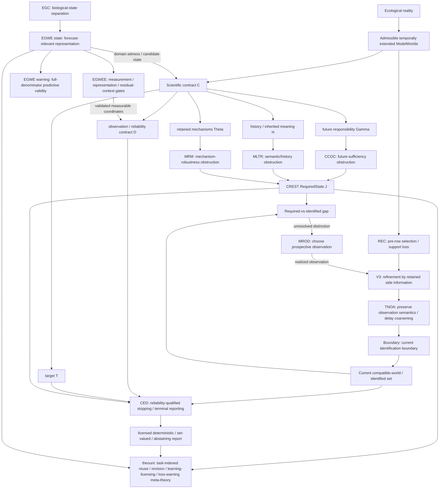

# World–State–Evidence hierarchy — 2026-09-08 synthesis

> **Status:** current cross-repository synthesis layer. This document does not modify the frozen Theory Universe v0.5 core, transfer theorem ownership, or turn empirical results into general theorems. It records the present division of labour among the CREST, observation-information, and eco-genetic (EG) programmes and the interfaces that connect them.

## 1. One shared worldview

The three programmes are not competing definitions of ecological state. They address different stages of one scientific problem:

> **A temporally extended ecological world contains more distinctions than any one scientific task needs. A scientific contract determines which distinctions matter; an observation system determines which of those distinctions are actually available; empirical validation determines whether proposed measurable summaries really carry the future-relevant information claimed for them.**

The common type separation is

```text
EcologicalReality
!= ModelWorld
!= RequiredState
!= ObservationRecord
!= CompatibleWorldSet
!= ReportableTarget
!= EmpiricalPartialState
```

unless an explicit bridge establishes the relevant factorization or equality.

The central three-stage separation is

```text
what must be distinguished
        !=
what has been distinguished by the evidence
        !=
what may now be reported at the declared risk level
```

and the empirical corollary is

```text
biologically plausible variable
        !=
future-relevant state representation
        !=
validated measurable proxy
        !=
predictive warning
```

## 2. The hierarchy at a glance



This diagram contains several relation types. It must not be read as one causal time sequence. In particular:

- **CREST arrows are mainly normative/representational:** they determine what a state must retain for a declared task.
- **REC/V3/TNOA/Boundary/MROD arrows are mainly operational/epistemic:** they describe loss, refinement, identification and prospective acquisition in an observation system.
- **EG arrows are validation/domain arrows:** they test whether candidate biological states, representations, warning rules and empirical proxies actually earn the claimed predictive role.
- **theouni is a meta layer:** it studies reuse, revision and task transport across these typed objects; it does not own the source results.

## 3. Upper layer — CREST asks what must be remembered

### 3.1 CREST

CREST begins with temporally extended model worlds and a scientific contract. Its object is the least-information adequate state: the coarsest quotient that may safely forget distinctions without violating the declared future, history, mechanism, evidence and target responsibilities.

Canonical question:

> **Which differences among ecological worlds may be erased without invalidating the scientific task?**

CREST therefore owns the distinction between a present snapshot and a contract-relative required state. It also supplies the cross-gate distinction

```text
required state != identified state != reportable target.
```

### 3.2 CCOC — future-sufficiency obstruction

CCOC is representation theory. It asks whether a compression that is exact under one closed future grammar remains comparably exact after legal future interactions/actions are enlarged.

```text
same present / same closed-grammar response
    does not imply
same required state under a wider future grammar
```

CCOC tells CREST that a merge is unsafe because a future-accessible response distinction was erased.

### 3.3 MLTR — semantic/history obstruction

MLTR asks whether an inherited classification can be carried through non-nested structural replacement, whether different replacement routes carry one coherent terminal meaning, and when historical context must be retained.

```text
same current descriptor
    does not imply
same inherited operational meaning after replacement
```

MLTR tells CREST that a merge is unsafe because source-carried semantics or route history differ in a way that changes the declared operational task.

### 3.4 MRM — mechanism-robustness obstruction

MRM asks whether worlds sharing the same visible present state retain response mechanisms that disagree under relevant interventions.

```text
same visible state
    does not imply
same required state when retained mechanisms disagree on a required future response
```

MRM does not require complete mechanism identity. It preserves only response-relevant mechanism distinctions.

### 3.5 CREST output

The combined output is not “the true ecological state.” It is a contract-relative required partition `J` over the declared model-world carrier.

That is the main handoff to the observation family:

> **CREST specifies the distinctions the monitoring/evidence system must be capable of earning.**

## 4. Middle layer — the observation family asks what evidence survives and resolves

The current observation family is `REC -> V3/TNOA -> Boundary <-> MROD`, with CED as the terminal reliability/reportability gate. These projects share compatible-world geometry but own different operators.

### 4.1 REC — support can be lost before a row exists

REC starts before semantic classification. It asks which biological exposures/events entered the retained dataset at all and whether entry selection changes the ecological estimand.

Its irreversibility rule is:

```text
true exposure omitted before record entry
    cannot be reconstructed by perfect downstream classification alone
```

An external exposure/reference design may reveal the shadow world; the final event table alone generally cannot.

### 4.2 V3 — retained side information can refine what remains

V3 studies refinement by information that already exists and has been retained. A reference channel can contract the compatible measurement-state set and therefore the compatible target-state set.

Its central rule is:

```text
refine before loss; preserve reversible transforms; do not confuse decomposition with subtraction
```

A realized future MROD observation becomes an ordinary V3-style refinement once acquired and retained.

### 4.3 TNOA — do not destroy scientific distinctions at the semantic interface

TNOA preserves positive target evidence, positive nuisance evidence, observability, attribution uncertainty and unresolved states instead of forcing premature binary collapse.

Its role is record semantics:

```text
rich process-aware evidence
    -> B / T / N / U or another justified decision vocabulary
```

TNOA may license record-level attribution claims, but it does not replace CED's scientific-target risk contract.

### 4.4 Boundary — characterize what the current observation map identifies

Boundary owns the current structural identification problem.

For realized evidence `e`, it characterizes the compatible-world fibre and the target image. In the finite target-specific form:

```text
|T(C_E(e))| = 1  -> target structurally point-identified
|T(C_E(e))| > 1  -> target remains set-valued / unresolved
```

This is structural identification, not terminal permission to report under a noisy/reliability contract.

### 4.5 MROD — choose which new observation should split what remains

MROD starts from a residual compatible mechanism region and a declared candidate-observation vocabulary. It asks which candidate observation is predicted to reduce residual mechanism/target ambiguity, recomputing after each realized acquisition.

Its object is prospective information/refinement, not terminal scientific permission.

### 4.6 CED — terminal reliability-qualified stopping and reporting

CED is the crossover between CREST's required distinctions and the observation family's attained distinctions.

The strongest non-overlapping role is:

> **Given a required distinction, a realized evidence state, a target and a calibrated reliability/failure contract, may monitoring stop and may a deterministic scientific target be reported at the declared false-resolution risk?**

This routing sharpens previous overlap:

- target constancy over the current compatible class is **Boundary infrastructure**, not a standalone CED novelty claim;
- generic prospective next-observation value belongs primarily to **MROD**;
- semantic preservation of unresolved observation states belongs to **TNOA**;
- CED owns the reliability/failure architecture and the risk-limited terminal report/stopping contract.

Thus the canonical interface is

```text
CREST J: what must be distinguished
Boundary E: what is structurally identified now
MROD/V3: how the identification boundary may be refined
REC/TNOA: how distinctions may be lost before or during representation
CED: whether the attained evidence is reliable enough to stop and report
```

## 5. Lower/domain-validation layer — EG asks whether proposed states actually predict the future

The EG programme is not merely an application of CREST. It is a domain-specific validation programme for future-relevant state claims in eco-genetic deterioration.

Programme-level question:

> **What must be biologically distinguished, representationally preserved, predictively validated and empirically measured before eco-genetic deterioration is forecastable?**

### 5.1 EGC — biological-state separation

EGC establishes that potential viability, realised occupancy, interaction, local effective size, genetic diversity, allele persistence and realised trait/function can respond differently to the same fragmentation contrast.

Its role is to reject the assumption that “eco-genetic condition” is one interchangeable scalar state.

### 5.2 EGWE state lane — forecast-relevant representation

EGWE asks what information a representation must retain for a declared future target and forecast horizon. Matching coarse marginals can still hide different next transitions when cross-layer alignment differs.

This is a domain-specific test of future-relevant representation, closely aligned with the CREST idea that adequacy is target/contract relative, but supported by its own simulator and natural-data evidence.

### 5.3 EGWE warning lane — precedence is not predictive validity

A signal can reliably occur before failures yet fail completely as a predictor if it also fires in non-failures. Warning validity therefore requires the full denominator and the declared predictive estimand, not event-conditioned temporal ordering alone.

```text
early signal != fate-discriminative warning
```

### 5.4 EGWEE — empirical state/proxy admission

EGWEE asks whether a proposed measurable ecological state first earns endpoint-relevant predictive status, whether its analytical representation preserves the needed information, and only then whether residual geography/history/context adds predictive information.

Canonical rule:

> **Test the state before interpreting the residual.**

This is the natural-data counterpart of the theouni Empirical Projection Gate.

## 6. The three main junctions

### Junction A — `RequiredState J` versus current evidence `E`

This is the principal CREST-observation connection.

```text
J = distinctions required by the scientific contract
E = distinctions currently supplied by the retained observation architecture
```

If `E` is too coarse relative to `J`, the difference is monitoring/identification debt. Boundary diagnoses the unresolved split; MROD can search for a prospective observation; V3 can use retained side information; CED decides when the resulting evidence is reliable enough for terminal reporting.

### Junction B — proposed state versus empirical predictive state

CREST can define what a declared model contract requires, but a natural measurement does not become a state coordinate by analogy alone.

```text
theoretical/domain-motivated candidate state
        -> EGWEE / Empirical Projection Gate
        -> held-out endpoint-relevant information
        -> bounded EmpiricalPartialState claim
```

A failed proxy is a measurement boundary, not evidence that the underlying biological process is irrelevant.

### Junction C — contract revision and state reuse

A representation adequate for one task need not remain adequate after the target, horizon, future grammar, mechanism responsibility or warning endpoint changes.

This is theouni's meta-level problem:

```text
adequate for C0
    does not imply
adequate or revisable for C1
```

CREST supplies concrete state-refinement causes; the observation family supplies evidence/identification consequences; EG supplies concrete forecast and warning counterexamples.

## 7. theouni's own position above the families

Theouni should not be treated as a fourth scientific source programme. It is the typed synthesis and reuse layer.

Its existing modules fit the hierarchy as follows:

| theouni module | cross-family interpretation |
|---|---|
| **TU-1 contract revision** | when a stored compression remains reusable after the scientific contract changes |
| **TU-2 learning vs licensing** | separates information that reduces causal/mechanism uncertainty from information sufficient to license the requested target |
| **TU-3 loss-state invariance** | asks which representation is sufficient for the complete declared loss-response signature rather than one convenient scalar |
| **TU-4 warning-state portability** | separates state sufficient for loss generation from state sufficient for warning evaluation and transport |
| **CIRA draft v0.6** | task-indexed factorization/reuse relation among state representations |
| **EAT draft** | local transition rule from identified target + satisfied reliability contract to an admissible scientific report |
| **Empirical Projection Gate** | route from measured coordinates to a bounded target-relative EmpiricalPartialState claim |

The hierarchy therefore gives theouni a compact meta-question:

> **When can a distinction, representation, evidence state or warning rule earned for one scientific task be safely reused for another?**

## 8. Overlap firewalls fixed by this synchronization

### Boundary versus CED

```text
Boundary = structural identification under the current observation map
CED      = reliability-qualified terminal reporting/stopping
```

A structurally point-identified target can still be withheld by CED if the reliability contract is not met.

### MROD versus CED

```text
MROD = prospective observation value / sequential acquisition
CED  = risk-limited terminal decision and reportability
```

CED may consume MROD-designed observations but should not claim generic next-observation selection as its defining novelty.

### TNOA versus CED

```text
TNOA = preserve and license observation-level semantics
CED  = license a scientific target after aggregating the declared evidence contract
```

### V3 versus Boundary/MROD

```text
V3       = already-retained side information refines the current compatible set
Boundary = describes the resulting current identification boundary
MROD     = selects a future observation expected to refine it
```

The compatible-set algebra is shared; the timing/operator is different.

### EGWE state versus CREST

```text
CREST     = general contract-relative required-state theory
EGWE state = eco-genetic domain test of whether candidate representations preserve forecast-relevant distinctions
```

EGWE provides domain evidence and counterexamples; it does not empirically validate CREST as a universal natural-state theory.

### EGWEE versus Empirical Projection Gate

```text
EGWEE = source empirical programme with locked natural-data analyses
EPG   = theouni generic admission contract distilled from that class of problems
```

The generic gate does not acquire ownership of EGWEE outcomes.

## 9. Canonical full loop

The current synthesis is a loop, not a one-way ladder:

```text
1. declare a scientific target / responsibility
2. CREST + CCOC/MLTR/MRM determine which world distinctions the task requires
3. inspect the observation pipeline:
      REC   — were relevant opportunities lost before row entry?
      V3    — is useful side information already retained?
      TNOA  — were distinctions collapsed semantically?
      Boundary — what is identified now?
4. if insufficient, MROD chooses a prospective observation and the realized result re-enters as V3-style refinement
5. CED decides whether the evidence is reliable enough to stop and report the target
6. EG/EPG tests whether proposed measurable state variables and warnings actually predict the declared endpoint in the relevant domain
7. if target, horizon, mechanism set or management responsibility changes, TU-1/CIRA reopen the reuse audit and the loop begins again
```

The shortest statement of the combined worldview is therefore:

> **Define the future-relevant distinction before measuring it; preserve information before losing or coarsening it; identify rather than assume what the observation map resolves; acquire new information only for distinctions that still matter; report only when reliability licenses the target; and require empirical proxies and warnings to earn their future-relevant status out of sample.**

## 10. Source ownership and synchronization snapshots

This synthesis was checked against the current main-branch source surfaces on 2026-09-08:

- `crest/README.md` — contract-relative world/state hierarchy and CED evidence gate;
- `ccoc/README.md` — open-future response-interface obstruction;
- `mltr/README.md` — carried semantics, route coherence and historical repair;
- `mrm/README.md` — response-relevant mechanism ambiguity and active discrimination;
- `ced/README.md` + Paper-B consolidation — evidence/reportability and failure/risk contracts;
- `rec/README.md` — record-entry selection and irreversibility;
- `v3/README.md` + `docs/CLOSED_LOOP_THEORY.md` — retained-information refinement and five-project compatible-world loop;
- `tnoa/README.md` + `tnoa/licensing.py` — process-preserving semantic states and record-level licensing;
- `boundary/README.md` + target-identification extension — present observation-map identification;
- `mrod/README.md` — residual mechanism ambiguity and sequential prospective observation design;
- `egc/README.md` + EG-series publication boundary — biological state separation;
- `egwe/README.md` — representation, warning validity and process portability;
- `egwee/README.md` — natural-data measurement/representation gate programme.

Source repositories retain theorem, code and empirical ownership. This file owns only the cross-repository typed synthesis.