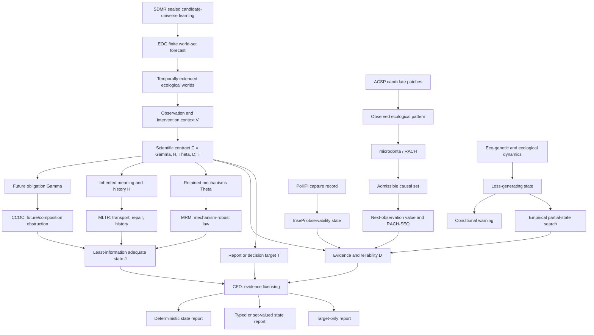

# Zuizui0223 ecological research universe

Status: the scientific audit covers 23 source repositories as of 2026-08-25. `theouni` is the 24th, meta-registry repository: it indexes that audit without acquiring source ownership. The companion machine-readable source is [`registry.json`](registry.json), and the bounded Bridge-A execution record is [`bridges/eco_genetic_crest_bridge_registry.json`](bridges/eco_genetic_crest_bridge_registry.json).

## Executive conclusion

The portfolio already forms a coherent research universe, but it is not a monolith and should not become one. Its common program is:

> **Start from temporally extended ecological worlds; declare what future, history, mechanism, evidence, and decision responsibilities matter; compress only distinctions that are safe to forget; identify only what the observation contract resolves; learn the next observation when ambiguity remains; and report dynamics or warning only at the state and evidence level actually earned.**

The decisive separation is:

```text
required state  !=  identified state  !=  reportable target
```

This makes the portfolio larger than “state theory plus applications.” It is a layered theory of ecological world construction, lawful compression, causal ambiguity, evidence licensing, learning, dynamics, and conditional warning.

No physical repository merge is justified. Exact tracked-blob auditing found no substantive cross-repository duplicate at the audited snapshots; the only shared blob of at least 500 bytes was the MIT license in three repositories. The duplication risk is conceptual and terminological, not code ownership.

## Canonical universe



The arrows are typed contracts, not imports. Dashed or proposed bridges in the registry remain unimplemented until their input/output schemas and claim ceilings are explicit.

## The central types

| Type | Meaning | Owner | What it is not |
|---|---|---|---|
| `World` | History + present + latent response structure + contemplated futures | CREST | an observed snapshot |
| `Contract` | `Gamma, H, Theta, D; T` | CREST | a free choice unconstrained by dynamics or evidence |
| `RequiredState` | Coarsest finite quotient adequate for the contract | CREST | necessarily the full simulator state |
| `EvidenceClass` | Worlds compatible with the reliable observation record | CED | an ontic ecological state |
| `Report` | Deterministic, typed, set-valued, or target-only licensed output | CED/CREST/MRM | forced full-state certainty |
| `AdmissibleCausalSet` | Causal programs compatible with model, constraints, and observations | RACH | a best-model winner |
| `CompleteSimulatorState` | Explicit state sufficient under a declared Markov closure | eco-genetic-criticality | a proved minimal or natural state |
| `BoundedEcoGeneticQuotient` | Coarsest CREST partition of an explicitly declared finite eco-genetic witness carrier | CREST adapter; source records remain in eco-genetic-criticality | the quotient of the full simulator or warning domain |
| `LossGeneratingState` | Warning-blindly frozen closure generating the downstream loss process | eco-genetic-warning-extensions | a habitat label or universal regime |
| `EmpiricalPartialState` | Candidate synchronized measurements earning status by held-out endpoint information | eco-genetic-warning-extensions / source system | a plausible proxy assumed sufficient |
| `FiniteWorldSet` | Compatible EOG transition worlds and their support projections | EOG | the true historical route |
| `ObservabilityState` | Noise/failure/attribution-risk state of the sensing process | InsePi | a biological interaction state |

## Core theory and inference repositories

| Repository | Ontology objects | Mathematical/scientific contract | Current claims | Evidence | Explicit non-claims |
|---|---|---|---|---|---|
| **crest** | worlds, context, contract, carrier, `J`, evidence `E`, target `T`, monitoring debt | finite common carrier + declared refinement closures + evidence factorization | unique coarsest finite adequate state; carrier/state/evidence/target scale separation | analytic proofs and finite witnesses | no intrinsic context-free state; no general continuous/stochastic trajectory theorem; no empirical frequency claim |
| **ccoc** | closed/open grammars, exact interfaces, memory gap | finite mostly deterministic systems and exact response preservation | open composition can force `m` extra bits despite a two-state closed interface | proof, finite certificates, replay | no observed-ecosystem validation; no semantic repair, mechanism inference, or evidence licensing |
| **mltr** | source/target stages, replacement relation, carried partition, repair, history mode | declared finite non-nested replacement and prefix-closed grammar | exact transport conditions, fiber-split obstruction, coarsest repair, transport defect, history completion | proof and deterministic replay | does not infer replacement relations or histories from field data; does not certify future/mechanism/evidence adequacy |
| **mrm** | candidate mechanisms, response types, candidate-safe quotient, discrimination plans | declared finite candidate family, actions, observations, and costs | candidate-independent deterministic law iff response types agree; otherwise typed/set-valued reports | proof, replay, implementation tests | does not infer candidate sets or mechanisms; does not inherit CED risk/failure guarantees |
| **ced** | experiment records, evidence classes, target-safe quotient, failure modes, risk/cost | finite actions/experiments + reliability/failure + target + false-resolution contract | honest report criterion; coarsest target-safe refinement; failure-aware and risk-limited resolution | proofs, exact outcome enumeration, calibration/probability bounds | required refinement is not already identified; evidence success does not prove structural adequacy |
| **microdonta / RACH** | admissible causal set, replaceability edges, `W=FE`, calibrated proxy, NOV | declared model family, constraints, observation map, tolerance, and source adapter | N1–N4 identifiability; RACH set; frozen RACH-SEQ synthetic advantage | algebraic proof, controlled benchmark, ABM robustness, prospective design | no best-model selector; current Campanula data do not identify the channel; no ownership of external programs |
| **eco-genetic-criticality** | interaction feedback, realized traits/function, alleles/diversity, complete simulator state | declared finite-population closure and frozen scientific commit | bounded H1/H3 mechanism evidence; coarse marginals can be transition-insufficient; absolute warning threshold rejected | theorem-guided finite simulation and locked ledger | no universal connectivity benefit, natural-state sufficiency, alignment-risk rule, or universal warning |
| **eco-genetic-warning-extensions** | C0–C4 conditions, loss state, incidence/heterogeneity/trajectory identity, relative warning, empirical state search | pinned parent + warning-blind selection + frozen seeds/domains/endpoints + endpoint-first field validation | strict within-state warning replication; connectivity/partner/portability boundaries; partial-state empirical tests | preregistered simulation, independent seeds, negative results, open-data prediction, access stops | no universal threshold/portability; no proxy-by-plausibility; no retuning, relabeling, or access-failure null |

## Material connector repositories

| Repository | Universe role | Owned object/claim ceiling | Primary handoff |
|---|---|---|---|
| **bita** | trait-to-function mechanism architecture | `A`, `D`, `W_AD=rho-iota-kappa`; one-sided selectivity bound; empirical `kappa` remains unidentified | candidate mechanism schema to MRM/RACH only after an explicit map; its `W` must not be confused with RACH `W=FE` |
| **izu-core** | state-dependent ecological response dynamics | starting functional position generates branching in the declared ABM; context allocates branches; assurance attenuates | exactly three nonblocking RACH adapters: signed position, effective service, complete response chain |
| **eog** | finite future-world reconstruction and forecast | exact latent world identity for update/audit; possible/robust/unresolved projections; identity was adverse as direct predictor | proposed EOG-world-to-CREST contract; frozen support/topology handoff to ACSP |
| **sdmr** | leakage-free environmental candidate-universe learning | sealed model/answer pools and frozen Product-A-to-B universe; biological result not yet established | future frozen pointwise support field to EOG |
| **acsp** | survey candidate generation | independently confirmed 2.5% robust-support candidate patches at the tested scale | external field observation design; no routing, budget, or occupancy semantics |
| **pollipi** | primary field capture and effort metadata | fixed timelapse record; adaptive modes are canaries; mesh decision is not a visit | trace/evidence stream to InsePi, then potentially CED/RACH after calibration |
| **insepi** | observation-process state | noise source, false/missed/attribution risk, observability state | proposed calibrated failure-domain adapter to CED |
| **island** | global macroecological comparison | conditional island floral/reproductive analysis with explicit evidence tiers | Chapter-1 context to izu-core; environmental compatibility is not service or loss |
| **hotarubukuro** | empirical phenotype/geography testbed | one final *C. punctata* color-geography pipeline | external empirical case for state/observation analysis; current pipeline keeps ownership |
| **fcp** | comparative pattern evidence | frozen 34-species spatial-organization comparison; no unique moisture mechanism | pattern can motivate RACH only after an observation map |
| **azami** | present-day spatial phenotype discovery | continuous visible thistle phenotype and environment structure | hands time/mechanism questions to EAzami |
| **EAzami** | functional evolutionary history | dated functional transitions and competing M0–M5 programs; adaptive model not recovered | potential history objects for MLTR; pigment specialization to chun |
| **chun** | molecular/semantic history of pigment states | reactivation requires active→suppressed→active history plus retained pathway evidence | candidate MLTR history application; separates visible from biochemical state |
| **shimahotarubukuro** | focal within-lineage measurement | specimen morphometrics and `Pst`; not `Qst` or selection | Chapter-3 measurement after island and izu-core |
| **odsp** | provenance tombstone | no active method, package, data, or publication | fully superseded by EOG support topology |

## Meta-registry repository

| Repository | Universe role | Owned object/claim ceiling | Explicit boundary |
|---|---|---|---|
| **theouni** | portfolio ontology, typed bridge registry, definability ledger, provenance manifest, and interactive navigation | owns the cross-repository index and generated view only | does not own source theorems, code, data, simulations, empirical evidence, or open-bridge resolution |

## What can be defined now

### Definable

- A finite contract-relative adequate state `J`, its evidence licensing, and finite monitoring debt.
- The aligned/anti-aligned eco-genetic two-world quotient: two required blocks for the exact next-interaction target, with a source-backed coarse-summary witness.
- Closed/open exact response interfaces, transport defect, history augmentation, candidate-safe quotients, evidence quotients, and target-safe reports.
- RACH admissible causal sets and NOV under a declared model/observation contract.
- Complete simulator state and loss-generating state inside the declared eco-genetic closure.
- EOG finite compatible-world sets and possible/robust/unresolved projections.
- ACSP candidate patches, PolliPi capture/probe records, InsePi observability records, and each empirical repository's declared measured variables.

### Conditionally definable

- Snapshot sufficiency, because it depends on the contract and the observation-to-world map.
- Macro-law transport, because replacement relation/history and legal grammar must be declared.
- Mechanism-robust law, because the retained candidate family and actions must be declared.
- Warning, because the loss-generating state and endpoint definition must be frozen first.
- Empirical partial state, because synchronized coordinates must predict the endpoint out of sample.
- EOG prediction state, because world universe, source closure, scale, and target horizon are declared choices.

### Empirically identifiable now

- Repository-specific observable targets such as visible phenotype distributions, specimen morphometrics, source-traceable comparative classifications, held-out ACSP enrichment, and selected held-out partial-state prediction results.
- The within-state simulator warning ordering is reproducibly identified for the frozen H2-R state; this is simulation evidence, not a natural-system universal.
- RACH channel identity is identifiable in principle with `W` and one exact or stably calibrated channel, but the present Campanula record does not meet that condition.

### Reportable despite unresolved state

- A target constant across an evidence class, even when multiple adequate-state classes remain possible.
- MRM typed or set-valued laws when a universal deterministic law does not exist.
- EOG possible/robust/unresolved sets without selecting one true historical world.
- RACH admissible explanation sets and next-observation designs without naming a winning mechanism.
- Bounded negative, non-replication, non-portability, and access/non-identifiability results.

### Fundamentally undefinable from the stated information

- One intrinsic ecological state independent of contract.
- `F` versus `E` channel change from `W`-only observations.
- One deterministic mechanism-independent law when retained response types disagree.
- One deterministic target value when it varies within an evidence-compatible class.
- The true historical route from positive occurrences alone.
- A confirmed flower visit from a PolliPi mesh decision.
- Pigment reactivation from visible color alone.
- Selection from `Pst` alone.
- Occupancy probability from an ACSP candidate patch.
- Pollination service or historical loss from an island environmental-compatibility diagnostic.

### Currently undefinable, but not proved impossible

- A general continuous/stochastic CREST trajectory theorem.
- The least adequate quotient of the full frozen eco-genetic simulator domain for a specified warning/management target. The implemented two-world quotient is only a bounded witness and does not close this larger question.
- A sufficient natural `S_emp` state across systems.
- Universal warning thresholds, direction-only warning causation, or cross-state warning portability.
- External validity of EOG's revised two-layer prediction head.
- SDMR real-plant method winner or universal niche-process core.
- Field-calibrated InsePi observability risk and broad scientific use of PolliPi classified modes.
- EAzami modular selection mosaic/adaptive-radiation inference and chun pigment reactivation histories.
- BITA joint-cost curvature and full empirical `W_AD` calibration.

The full 32-row classification ledger is in the registry.

## Overlaps, contradictions, and ownership collisions

### 1. `state` is overloaded

There is no factual contradiction, but there is a type collision:

```text
CREST RequiredState
!= eco-genetic CompleteSimulatorState
!= eco-genetic EmpiricalPartialState
!= EOG LatentWorldState
!= InsePi ObservabilityState
```

Every cross-repository artifact should use the qualified type. Unqualified `state` should be rejected by registry validation outside repo-local prose.

### 2. Partition refinement is shared mathematical substrate

CREST, CCOC, MLTR, MRM, and CED all use partitions/refinements. Ownership is distinguished by the initial equivalence and output:

| Repository | Initial equivalence | Refinement target |
|---|---|---|
| CCOC | same closed-grammar response | open-grammar exact interface |
| MLTR | carried source labels after replacement | coarsest exact target repair |
| MRM | visible state across candidate mechanisms | response-relevant candidate-safe state |
| CED | same reliable experimental record | target/action-safe evidence resolution |
| CREST | baseline world compression | joint contract-relative adequate state |

Generic partition refinement is not a separate novelty claim in any of them.

### 3. Observation design has three owners, but three estimands

- **MRM** asks which action discriminates declared response types.
- **RACH** asks which feasible observation reduces an admissible causal set or its equivalence edges.
- **CED** asks whether a failure-aware, reliability-qualified experiment licenses the target under risk/cost rules.

They are composable, not interchangeable. RACH does not inherit CED's reliability guarantees; MRM does not infer its candidate family; CED does not construct a biological causal program family.

### 4. `W` is not a shared variable

BITA's `W_AD` mixed partial and RACH's `W=FE` net-performance factorization use the same letter for different mathematical objects. A bridge must define units, outcome scale, factorization, and observation map. Direct symbol matching is forbidden.

### 5. Exact world identity versus adequate compression

EOG's heldout result does not contradict CREST. It shows that exact latent identity was a poor direct predictive representation for one endpoint, while remaining useful for sequential update and falsification. CREST predicts precisely that the useful state is target- and contract-relative, not necessarily maximally detailed.

### 6. Complete simulator state versus least adequate state

The eco-genetic complete state is proved sufficient under its closure. CREST asks a different question: what coarser quotient is still adequate for a declared warning, intervention, or prediction target? The new CREST-side adapter now computes this exactly on the declared aligned/anti-aligned two-world carrier and refutes their coarse-summary merge. It does not establish full carrier coverage, so “complete and sufficient” still must not be rewritten as “minimal.”

### 7. Exact duplicate ownership

At the audited scientific snapshots, substantive exact code/data duplication is absent. The previous microdonta eco-genetic mirror has been removed; eco-genetic-criticality is the sole parent code/evidence owner. ODSP is a tombstone after transfer to EOG. `theouni` intentionally republishes registry and visualization snapshots, but those are meta-index artifacts rather than transfers of scientific ownership.

## Bridge implementation status and remaining priorities

### Bridge A — `EcoGeneticState -> CREST Contract` — bounded implementation complete

Purpose: compute or refute a least adequate quotient for a frozen simulator and target.

Required schema:

```yaml
carrier_world_id: stable finite world/trajectory identifier
present_state_fingerprint: hash of explicit simulator state
future_law_fingerprint: forcing + stochastic law
contract:
  gamma: declared interventions/forcing family
  history: retained trajectory/history obligations
  theta: retained mechanism alternatives
  evidence: observation/reliability map
  target: warning/function/management output
required_response_signature: exact or tolerance-qualified target response
```

Implemented locally in CREST as a source-decoupled adapter with tests, a reproducible example, and a machine-readable registry. It consumes opaque records and checks source provenance format, one-law carrier coherence, unique world IDs, warning-blind state selection, and a no-warning-outcome selection guard.

The first execution uses `eco-genetic-criticality` commit `78fc101a809ebdc5d4f2295b9c92757510e71a75` and its aligned/anti-aligned state-sufficiency witness:

| Evidence contract | Required quotient | Full state licensed | Exact-next-field target licensed | Monitoring debt |
|---|---:|---:|---:|---:|
| coarse marginals only | `{aligned}`, `{anti_aligned}` | no | no | 1 bit |
| joint patch alignment observed | same two blocks | yes | yes | 0 bits |

This establishes an exact local quotient and a constructive coarse-summary insufficiency witness. The carrier is explicitly marked incomplete, so the full simulator/ warning-domain quotient remains open. No warning calibration, endpoint, seed family, evidence ledger, or claim boundary was changed. The implementation is currently a clean local uncommitted extension on CREST base snapshot `b552d01ad3be88501edce52262e19f263e0d8211`; repository publication remains a separate action.

### Bridge B — `RACH AdmissibleSet -> MRM CandidateLawFamily -> CED EvidencePlan`

Purpose: turn unresolved causal programs into an honest mechanism-safe law and then a reliability-qualified next experiment.

Required stages:

1. RACH exports candidate IDs, equivalence edges, prediction signatures, and feasible observations.
2. MRM maps candidates to response types and returns deterministic/typed/set-valued laws.
3. CED maps proposed observations to record partitions, shared failure factors, resets, calibration, risk, cost, and target.
4. The output distinguishes predicted information gain from licensed resolution probability.

### Bridge C — `PolliPi/InsePi -> CED`

Purpose: make sensor failure architecture scientifically creditable.

Required fields: capture mode, effort denominator, frame/probe fingerprint, observability state, false/missed/attribution calibration interval, failure-domain ID, reset/independence assumption, manual-label provenance, and target record mapping.

Until calibration exists, this bridge can carry audit metadata but cannot certify a biological event.

### Bridge D — `SDMR SupportField -> EOG WorldUniverse -> ACSP CandidatePatch`

Purpose: preserve semantics across environmental learning, world-set reachability, and field candidate generation.

Required fields: raster/projection/scale, candidate-universe fingerprint, training versus sealed evidence role, support interpretation, threshold ladder, mask, source anchors, transition rule, EOG world fingerprint, ACSP validation-region ID, and claim ceiling.

The adapter must prevent `relative suitability -> reachability -> occupancy probability` collapse.

### Bridge E — `EAzami/chun History -> MLTR ReplacementSystem`

Purpose: test whether a phenotype/pigment category is transportable across lineage replacement or requires history augmentation.

Required fields: source and target state spaces, tree/topology set, transition-history class, biochemical state, observable output, legal comparisons/interventions, correspondence relation, and uncertainty status. A tree alone does not supply the MLTR relation.

### Bridge F — `EmpiricalPattern -> RACH ObservationContract`

Purpose: allow FCP, hotarubukuro, island, azami, bita, and shimahotarubukuro outputs to motivate causal inference without upgrading association to mechanism.

Required fields: empirical unit, time/cohort, measured target, candidate causal programs, exact observation map, calibration status, missing channels, and forbidden shortcuts.

## Graphify-compatible registry contract

The registry uses stable IDs:

- repository nodes: `repo:<name>`;
- ontology nodes: `concept:<name>`;
- typed relations: `conceptual_obstruction_input`, `downstream_evidence_licensing`, `mechanistic_parent_to_condition_extension`, `three_nonblocking_observation_adapters`, `superseded_by`, and explicit `missing_*_bridge` types.

Each repository record carries:

- snapshot SHA and status;
- ontology objects it owns;
- declared contracts;
- claims with evidence status;
- evidence classes;
- adapters/handoffs;
- explicit non-claims;
- source file and line ranges.

Each relation carries a `contract` field that states what the handoff may and may not mean. Proposed bridges have a non-final `status`; Graphify must display them as proposed or missing, never as extracted facts.

The derived Graphify artifact is [`../graphify-out/graph.json`](../graphify-out/graph.json), and the interactive view is [`../graphify-out/graph.html`](../graphify-out/graph.html).

## Provenance and Graphify audit

- All 23 scientific source repositories were inspected at the SHAs recorded in the registry; `theouni` records its own base snapshot separately as the meta-registry assembly point.
- Dirty or non-default local checkouts for ACSP, chun, EOG, InsePi, and PolliPi were not modified; detached `origin/main` snapshots were used.
- Twenty-two repositories produced non-empty deterministic code graphs. ODSP is a documentation-only tombstone and produced no AST node.
- The merged structural graph contains **40,625 nodes and 98,932 edges**.
- Health check: missing endpoints `0`, dangling endpoints `0`, collapsed endpoint edges `0`, self-loops `1`.
- Graphify warned that 3,868 merged nodes lack `source_file`, mostly external import/reference nodes. This lowers source-level traceability for those nodes.
- The curated registry view contains **429 nodes, 601 directed edges, and 16 named communities**. Its pre-build integrity gate found no missing/dangling endpoints, self-loops, duplicate edges, or same-endpoint edge collapse.
- No scientific theorem or empirical conclusion is inferred from graph centrality, graph paths, or repository proximity alone.

## Architecture decision

Keep the repositories separate. Standardize only the registry and adapter contracts.

The correct unit of integration is not a monorepo. It is a provenance-preserving research graph in which every edge declares:

1. the source object;
2. the target object;
3. the admissible transformation;
4. the evidence status;
5. the claim ceiling;
6. the conditions under which the edge fails.

That architecture is already consistent with the user's worldview: ecological knowledge advances not by erasing distinctions among projects, but by proving which distinctions may safely be forgotten for a declared scientific purpose.
